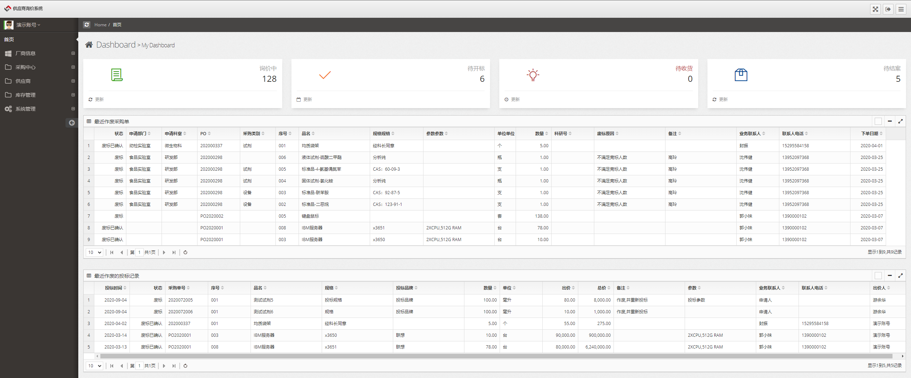

## 询价系统业务需求
该系统需求包括四个主要流程：导入、竞标、开标和交付/收货管理。操作员将询价 Excel 文件导入系统并向供应商发布询价单，供应商在截止日期前进行竞标并可进行重新报价。截止日期后，操作员审核竞标并确认中标供应商，系统通知中标供应商。在收到中标通知后，供应商将获胜标识 QR 码粘贴在包装箱外，并在收到货物时扫描 QR 码以确认产品信息和发票信息。系统还提供了查询功能和移动版本，特别授权的用户可以查看所有竞标信息但无法修改。系统界面应简单易用。
### Demo
https://supplier.i247365.net/
   + login user / password
   + demo / 123456
### screen capture

1.	发标
-  	导入：操作员在系统中导入询价execl文件（字段包括：采购单编号、品名、规格、单位、数量、品牌、货号、参数、备注、到货日期、业务联系人、联系电话、控制价）等信息。
-	发标：操作员选择询价商品，输入询价截止日期，系统把询价单发给所有供应商，同时通过短信提醒供应商联系人。
2.	投标
-	投标：供应商收到询价通知后，在询价截止日期前，登录系统，在询价单的基础上输入部分信息，供应商可以修改商品情况（品名、规格、单位、数量、品牌、货号、参数、备注、价格、到货日期）、等信息。 
-	重新投标：在询价截止日期前，供应商可以重新报价。截止日期后，供应商不能修改。
-	在询价截止日期前，除特别授权用户外，其它用户无法看到投标供应商信息和报价信息。系统可以提示有多少家供应商已投标。
3.	开标
-	询价截止日期后，操作员查看每个商品的投标情况，系统能提示投标信息和标书不一致的内容，操作员最终确定中标供应商，系统通过短信通知中标供应商。

4.	发货和收货管理
-	供应商收到中标通知后，下载打印中标通知二维码，贴到包装箱外部醒目位置。
-	收货人员收到货后，扫描二维码，核对商品信息、发票信息，无误后确认收货。

5.	其它要求
-	提供查询功能：查询多种条件（时间、供应商、商品等）查询已询价、未询价、询价中、已交货、未交货商品。
-	特别授权用户能查阅所有投标信息，但不能修改。
-	开发手机版（小程序或者H5）。
-	系统简单易用，界面简洁大方。
